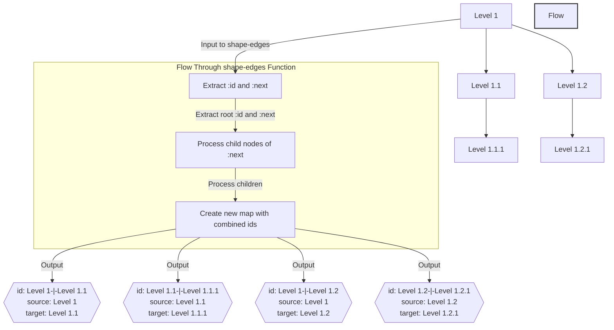

The following post will show you how to decompose a tree-link structure with a parent-child relationship into a list of nodes and edges using the standard clojure library and <a href="https://github.com/noprompt/meander" target="_blank" rel="noopener">Meander</a>.

## Background

I have a hierarchy that is stored as in a JSON with a parent-child relationship via a *:next* key. When representing this structure on the frontend, I used React Flow which requires a list of nodes and edges to be passed to the component.

Here is the process we'll follow:
- create a tree-seq traverser function that branches based on the link-type (:next as an example here) and extracts all the nodes
- prepare the nodes to be consumed by React Flow - this is where you'll need to customize your code in case you are not using React Flow
- create a function using Meander that recursively transforms the tree structure into a list of edges (id, source and destination)

## Prerequisites

Basic knowledge of Clojure/Script. React Flow is optional but this post will be applicable to any situation that requires you to decompose a tree-like structure into nodes and edges.

## Data

Assume you have a data structure like so:

```json
{
  "id": "Level 1",
  "name": "Level 1",
  "next": [
    {
        "id": "Level 1.1",
        "name": "Level 1.1",
        "next": [
            {
                "id": "Level 1.1.1",
                "name": "Level 1.1.1"
            }
        ]
    },
    {
        "id": "Level 1.2",
        "name": "Level 1.2",
        "next": [
            {
                "id": "Level 1.2.1",
                "name": "Level 1.2.1"
            }
        ]
    }
  ]
}
```

Let's use *tree-seq* from the ClojureScript library to gather all the nodes, Level 1, Level 1.1, Level 1.2, Level 1.1.1 etc.

```clj
(defn get-nodes-from-tree [data link-type]
  (tree-seq
    (fn [node] (seq (link-type nde))
    link-type
    data))
)
```

For the <a href="https://reactflow.dev/" target="_blank" rel="noopener">React Flow</a> component, each node must have a *data* field, and an optional *position* object for help place the node on the screen.

```clj
(defn shape-nodes [data link-type]
  (->> (get-nodes-from-tree data link-type)
       (map #(dissoc % link-type))
       (map (fn [node] {
                  :id (:id node)
                  :position {:x 0 :y 0}
                  :data (assoc node :label (:name node))
            }))))
```

## Decomposing Edges

React Flow requires edges to be of a certain format too, namely an id, source (id) and a target (id):

example

```json
[{
    "id": "Level 1 -|- Level 1.1",
    "source": "Level 1",
    "target": "Level 1..1"
}
...
]
```

Let's take a look at how we can manage this transformation using Meander

```clj
(ns app.graph
    (:require [meander.epsilon :as m]))

(defn shape-edges [input link-type]
  (->> (m/search 
            input

            {:id ?id ~link-type (m/scan {~link-type _ & ?children})}
            {:id (str ?id "-|-" (:id ?children))
            :source ?id :target (:id ?children)}
            
            {~link-type (m/scan (m/cata ?child))}
            ?child)
        (into []))
)
```

The given Clojure code uses the Meander library to perform a pattern-based search and transformation on the `input` data structure. Here's a step-by-step explanation of what each part does:

1. **Pattern Matching and Searching**: 
   The `m/search` macro is used to search for patterns in the `input` data structure. This involves defining a pattern that the input is matched against and extracting values from the input that match the pattern.

2. **Patterns**:
   ```clojure
   {:id ?id ~link-type (m/scan {~link-type _ & ?without-children})}
   ```
   This pattern is looking for a map with a key `:id` and another key specified by the value of `link-type`. The value associated with `link-type` is scanned for a nested map that also contains a key of the same `link-type`. The `m/scan` function is used to search deeply through nested structures. The `& ?children` syntax captures the rest of the map excluding the current `link-type` key-value pair.

3. **Transformation**:
   ```clojure
   {:id (str ?id "-|-" (:id ?without-children))
   :source ?id :target (:id ?without-children)}
   ```
   When the pattern is matched, this part defines how to transform the matched data. It constructs a new map with:
   - `:id` being a concatenation of the matched `?id` and the `:id` of `?children` separated by "-|-".
   - `:source` being the matched `?id`.
   - `:target` being the `:id` of `?children`.

4. **Recursive Pattern**:
   ```clojure
   {~link-type (m/scan (m/cata ?child))}
   ```
   This pattern specifies that the value associated with `link-type` should be recursively processed. `m/cata` is a Meander function used for defining recursive patterns. It indicates that the search should continue to apply the same pattern to the nested structures within the `link-type` key.

5. **Returning the Result**:
   ```clojure
   ?child
   ```
   Finally, `?child` represents the result of recursively applying the pattern to the nested structure. The `m/search` macro will return all instances of the transformation defined in the previous step for each match found in the input structure.



### Summary
The provided Meander search pattern is designed to recursively traverse a nested data structure (where nesting is indicated by a specific `link-type` key), extract certain pieces of data (`:id` values), and transform them into a new format. The transformation involves combining the `:id` of the current level with the `:id` of a nested structure and creating a new map with specific keys `:id`, `:source`, and `:target`.

Here's a more concise summary of what the code does:
1. Searches through a nested data structure for patterns where a map contains an `:id` and a nested map indicated by `link-type`.
2. For each match, it creates a new map that combines `:id` values and indicates source-target relationships.
3. Recursively applies the pattern to nested maps to perform the same transformation throughout the entire structure.

Putting this together, we get our nodes and edges for React Flow

```clj
(let [nodes (shape-nodes data :next)
      edges (shape-edges data :next)]
      ($ ReactFlow {:nodes (clj->js nodes)
                    :edges (clj->js edges)}))
```

The example above uses UIX as React wrapper in ClojureScript.