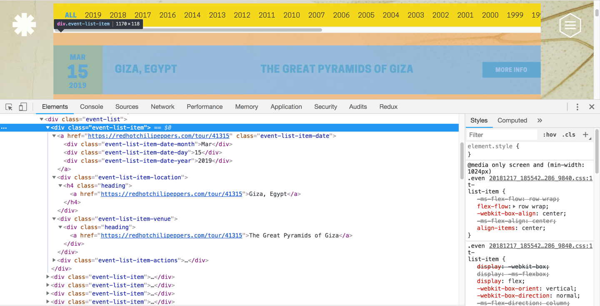

For a data visualization project I'm working on, I wanted to get concert information on the Red Hot Chilli Peppers (RHCP). More specifically, I wanted to scrape their [tour website](https://redhotchilipeppers.com/tour/past) so this post will show you how to do that.


### Goals

- Use Node.js, Cheerio and Simple Crawler to fetch the RHCP data and parse it.
  - Build a plugin system to transform the data through middleware that involves using external API's
  - Apply Dependency Injection to the plugins to keep them flexible


#### Flow


#### Prerequisites

I'll be using node **10.9.0** for this guide but you should be able to use it with any recent version.

```
npm i -g yarn

#main packages
yarn add request request-promise simplecrawler cheerio

yarn add  dotenv lodash.merge lodash.range geojson
```


#### Walkthrough

The first component that we will tackle is the **PageScrapper**.

Before we start writing any code, let's get an idea of the HTML structure we're parsing. Openning up https://redhotchilipeppers.com/tour/past we see this page:


On opening the Chrome inspector tools and focusing on one entry, we can figure out how we want to parse this page:



We want to narrow our focus on the **event-list** class that has the list of concerts. Drilling down even further, we observe the **event-list-item** class where we will pick up the important pieces of information:

- date (**event-list-item-date**)
  - month (**event-list-item-date-month**)
  - day  (**event-list-item-date-day**)
  - year  (**event-list-item-date-year**)
- location  (**event-list-item-location**)
- venue  (**event-list-item-venue**)

Great, let's first pull this webpage into our code:

**index.js**

```javascript{numberLines: true}
const rp = require('request-promise');
const $ = require('cheerio');
const url = 'https://redhotchilipeppers.com/tour/past';

rp(url)
  .then(function(html){
    //success!
    console.log($('.event-list-item', html).length);
  })
  .catch(function(err){
    //handle error
  });
```

Running

```bash
node index.js
```

should present a number of **50** in the console, or whatever the number of entries you see on that page. 

Great, you've successfully pulled the first page from the tour website. Let's move on to actually getting all the info we want (listed above) in a clean format.

**src/PageScrapper.js**

```javascript{numberLines: true}
function PageScrapper({ parser = null }) {
  if (!parser) {
    throw new Error('A parser needs to be defined');
  }
  this.$ = parser;
}

PageScrapper.prototype.scrape = function(html) {
  const $ = this.$;
  const numItems = $('.event-list-item', html).length;
  const $eventMonths = $('.event-list-item-date-month', html);
  const $eventDays = $('.event-list-item-date-day', html);
  const $eventYears = $('.event-list-item-date-year', html);
  const $eventLocations = $('.event-list-item-location a', html);
  const $eventVenues = $('.event-list-item-venue a', html);

  const events = [];
  for (let i = 0; i < numItems; i++) {
    let event = {};

    const date = {};
    date.month = $eventMonths.eq(i).text();

    date.day = $eventDays.eq(i).text();

    date.year = $eventYears.eq(i).text();

    const location = $eventLocations.eq(i).text();

    let loc = {};
    if (location === '?' || '') { /* highlight-line */
      loc = null;
    } else {
      loc.name = location;
    }

    event.venue = $eventVenues.eq(i).text();

    event = {
      ...event,
      location: loc,
      date
    };
    events.push(event);
  }
  return events;
};

module.exports = PageScrapper;
```

Our **PageScrapper** factory takes in a parser as an argument. In our case, we will use cheerio but to keep it flexible, we can use another drop in replacement should we need to in the future.

You'll notice that there's a conditional **?** when testing for the location. If you look at some of the last pages, the location is unknown and shown with a question mark. I've decided to make the **location** key **null** in these cases.

The heavy lifting is done by the **scrape** function which takes in the web page (an html string) as an argument and then returns the list of concerts (events) in the following format:

```json
{
    "venue": "Band Together Bay Area",
    "location": { "name": "San Francisco, CA"},
    "date": { "month": "Dec", "day": "14", "year": "2017" }
}
```

Great, let's setup this parser and call it on our webpage.

```javascript{numberLines: true}
const rp = require('request-promise');
const $ = require('cheerio');
const url = 'https://redhotchilipeppers.com/tour/past';
const PageScrapper = require('./src/PageScrapper');
const pScrapper = new PageScrapper({ parser: $ });

rp(url)
  .then(function(html) {
    console.log($('.event-list-item', html).length);
    const scrapedResult = pScrapper.scrape(html);
    console.log(JSON.stringify(scrapedResult, null, 4));
  })
  .catch(function(err) {
    //handle error
  });

```

Which will output the **50** entries in the format we've defined above.

##### Crawler

We now know that our parser works correctly given the HTML. Let's now move on to building a web crawler that goes through all the concert pages and gives it to the parser. We'll then join all the individual lists to make our final list of concerts.

How do we do that? Let's look at our main page at https://redhotchilipeppers.com/tour/past. Scroll to the bottom and you see this pagination:


Inspecting this element we see this:


We'll need to get the list of **href** elements under the class **pagination-numbers**, filter by non **active** classes and then pick the *first* and *last* items. We'll then create a range from the *first* to the *last* items and create a url for each page that will be added to the sources to discover.

- https://redhotchilipeppers.com/tour/past/page/2
- https://redhotchilipeppers.com/tour/past/page/3
- …...
- https://redhotchilipeppers.com/tour/past/page/33 (your last index may differ)

**src/Crawler.js**

```javascript{numberLines: true}
const cheerio = require('cheerio');
const SimpleCrawler = require('simplecrawler');
const range = require('lodash.range');
const Promise = require('bluebird');

const PageScrapper = require('./PageScrapper');
const pScrapper = new PageScrapper({ parser: cheerio });

function Crawler({ baseUrl = null, startUrl = baseUrl }) {
  if (!baseUrl || !startUrl) {
    throw new Error('baseUrl and startUrl paramerters need to be defined');
  }
  this.baseUrl = baseUrl;
  this.startUrl = startUrl;
  this.crawler = new SimpleCrawler(this.startUrl);
}

Crawler.prototype.start = function() {
  return new Promise((resolve, reject) => {
    this.crawler.maxDepth = 1; /* highlight-line */
    this.crawler.interval = 10000; // Ten seconds
    this.crawler.maxConcurrency = 3;

    const results = [];
    this.crawler.on('fetchcomplete', (queueItem, responseBuffer) => {
      console.log('fetch complete for ', queueItem.url);
      const scrapedResult = pScrapper.scrape(responseBuffer.toString('utf8'));
      results.push(scrapedResult);
    });

    this.crawler.on('complete', (queueItem, resources) => {
      var merged = [].concat.apply([], results);
      console.log('Results Size', merged.length);
      resolve(merged)
    });

    this.crawler.discoverResources = buffer => {
      const $ = cheerio.load(buffer.toString('utf8'));

      const hrefs = $('.pagination-numbers a[href]').filter(function() {
        return !$(this).hasClass('active');
      });

      const numMatch = /(\d+)/;
      const firstHref = hrefs.first().text();
      const lastHref = hrefs.last().text();
      try {
        const startPagination = parseInt(numMatch.exec(firstHref)[0]);
        const lastPagination = parseInt(numMatch.exec(lastHref)[0]);

        const urls = range(startPagination, lastPagination + 1).map(
          num => `${this.baseUrl}/tour/past/page/${num}`
        );
        return urls;
      } catch (e) {
        console.log(e);
        return [];
      }
    };
    this.crawler.start();
  });
};

module.exports = Crawler;

```

Our crawler starts with an intial page to discover which in our case is https://redhotchilipeppers.com/tour/past

The **crawler.discoverResources** function takes this page and extracts the pagination links and adds them to the queue of pages for the crawler to move to.

Each page, including the start page is passed to the **fetchcomplete** event for further processing. Here we pass the HTML to our **PageScrapper** to extract our data and append it to the *results* array.

After all the pages have been visited in the queue, the **complete** event is called where we just concatenate all the individual result array and flatten it.

We set **maxDepth = 1** for now to test our code. This will ensure that only the initial page is pulled.

Once we're happy with our program, we'll set **maxDepth = 2** to ensure that other than the initial page, the crawler doesn't add the pagination links for the new pages discovered from the initial link. The number of pages will most likely been the same during the crawl.

Let's try running the crawler:

```
const Crawler = require('./src/Crawler');
const baseUrl = 'https://redhotchilipeppers.com';
const startUrl = `${baseUrl}/tour/past`;
const crawler = new Crawler({ baseUrl, startUrl });

crawler.start().then(data => {
  console.log(JSON.stringify(data));
});

```

You've now successfully pulled all the info from all the past concerts!

##### Plugins

Our data looks like this:

```json
{  
   "venue":"The Great Pyramids of Giza",
   "location":{  
      "name":"Giza, Egypt"
   },
   "date":{  
      "month":"Mar",
      "day":"15",
      "year":"2019"
   }
}
```

We want to transform it into this:

```json
{
	"venue": "The Great Pyramids of Giza",
	"location": {
		"name": "Giza, Egypt",
		"lat": "30.0170059",
		"lon": "31.2134513",
		"address": {
			"city": "Giza",
			"state": "Giza Governorate",
			"postcode": "12541",
			"country": "Egypt",
			"country_code": "eg"
		},
		"timezoneId": "Africa/Cairo"
	},
	"date": {
		"month": "Mar",
		"day": "15",
		"year": "2019"
	},
	"geojson": {
		"type": "Feature",
		"geometry": {
			"type": "Point",
			"coordinates": [31.2134513, 30.0170059]
		},
		"properties": {
			"venue": "The Great Pyramids of Giza"
		}
	}
}
```

We'll do it through a series of plugins using middleware that transforms the data before returning it from the crawler.


The plugins will be named:

1. **LocationIQ** - This will take the name of the location and give us the latitude, longitude and deconstructed address of the place including the country, state and city. **lat, lon and address** fields in the **location** key above.
2. **GeoNames** - This will take the latitude and longitude and give us the timezone of the place. **timezoneId** in the **location** field.
3. **GeoJSON** - this is take the longitude and latitude of a place and give us the GeoJSON point. The **geojson** field.

They'll run in sequential order. We'll look at the **LocationIQ** plugin first.

**src/plugins/LocationIQ.js**

```javascript{numberLines: true}
require('dotenv').config();
const Promise = require('bluebird');
const rp = require('request-promise');
const baseUrl = 'https://eu1.locationiq.com/v1/search.php';

const locationIQOptions = ({ location }) =>
  `${baseUrl}?key=${process.env.LOC_IQ_API_KEY}&q=${encodeURI(
    location
  )}&format=json&limit=1&addressdetails=1`;

function LocationIQ({
  /* highlight-start */
  fn = null,
  fieldsFn = (data, dataToAdd) => ({ ...data, dataToAdd }),
  mergeFn = data => data
  /* highlight-end */
}) {
  const cache = {};
  return data => {
    return new Promise((resolve, reject) => {
      const location = fn.call(this, data);
      if (!location) return resolve(data);
      if (cache[location]) {
        console.log('cache hit for ', location);
        return resolve(mergeFn({ data, dataToAdd: cache[location] }));
      }

      Promise.delay(501) /* highlight-line */
        .then(() =>
          rp({ uri: locationIQOptions({ location }), json: true }).then(
            response => {
              const locationData = fieldsFn(response[0]);
              cache[location] = locationData;
              return resolve(mergeFn({ data, dataToAdd: locationData }));
            }
          )
        )
        .catch(reject);
    });
  };
}

module.exports = LocationIQ;
```

We'll be using a service called **[Location IQ](https://locationiq.com)** that has a good free tier. We just need to make sure to reduce the frequency of our calls to the API which we do in line **26**.

Go ahead and register for an account and copy your API key into the **.env** file. This is used by **dotenv** to pull the key into our plugin thereby securing it. You don't want to commit **.env** to your source control.

**.env**

```bash
LOC_IQ_API_KEY=**YOUR_LOCATION_IQ_API_KEY**
```

Coming back to our **LocationIQ.js** plugin, our function takes in 3 parameters:

- fn: This function is called to get the name of the location from the data to pass to the LocationIQ service
- fieldsFn: This function is called to pick a subset of attributes from the LocationIQ service. For example, we only care about the **lat**, **lon** and **address** fields from the service
- mergeFn: This function decides how the data from the LocationIQ service is merged with the original data. In this case, we want the **lat**, **lon** and **address** fields to be merged inside the **location** key from the original data


Let's try running it on our dataset:

**index.js**

```javascript{numberLines: true}
const Crawler = require('./src/Crawler');
const baseUrl = 'https://redhotchilipeppers.com';
const startUrl = `${baseUrl}/tour/past`;
const crawler = new Crawler({ baseUrl, startUrl });
const merge = require('lodash.merge');
const Promise = require('bluebird');

const getFields = (fields = null) => {
  return data => {
    if (fields) {
      const result = {};
      fields.forEach(field => {
        result[field] = data[field];
      });
      return result;
    }
    return data;
  };
};

const mergeOutput = (output = null) => {
  return ({ data, dataToAdd }) => {
    if (output) {
      return merge(data, { [output]: dataToAdd });
    }
    return merge(data, dataToAdd);
  };
};

const LocationIQ = require('./src/plugins/LocationIQ')({
  fn: data => {
    if (!data.location) return null;
    return data.location.name;
  },
  fieldsFn: getFields(['lat', 'lon', 'address']),
  mergeFn: mergeOutput('location')
});

crawler.start().then(data => {
  Promise.mapSeries(data, LocationIQ).then(result => {
    console.log(JSON.stringify(result));
  });
});

```

Which will output a list of items, each having the structure like this:

```json
{
	"venue": "The Great Pyramids of Giza",
	"location": {
		"name": "Giza, Egypt",
		"lat": "30.0170059",
		"lon": "31.2134513",
		"address": {
			"city": "Giza",
			"state": "Giza Governorate",
			"postcode": "12541",
			"country": "Egypt",
			"country_code": "eg"
		}
	},
	"date": {
		"month": "Mar",
		"day": "15",
		"year": "2019"
	}
}
```

We now want to feed this to another plugin GeoNames, that we'll create now to get the location timezone. Go ahead and create an account at http://www.geonames.org and add your key to the **.env** file.

```bash
LOC_IQ_API_KEY=**YOUR_LOCATION_IQ_API_KEY**
GEO_NAMES_API_KEY=**YOUR_GEO_NAMES_API_KEY**
```

**src/plugins/GeoNames.js**

```javascript{numberLines: true}
require('dotenv').config();
const Promise = require('bluebird');
const rp = require('request-promise');
const baseUrl = 'http://api.geonames.org/timezoneJSON';

const geoNamesOptions = ({ lat, lon }) =>
  `${baseUrl}?lat=${lat}&lng=${lon}&username=${process.env.GEO_NAMES_API_KEY} `;

function GeoNames({
  fn = null,
  fieldsFn = (data, dataToAdd) => ({ ...data, dataToAdd }),
  mergeFn = data => data
}) {
  const cache = {};

  return data => {
    return new Promise((resolve, reject) => {
      const location = fn.call(this, data);
      if (!location) return resolve(data);

      const [lat, lon] = location;
      if (cache[`${lat},${lon}`]) {
        console.log('cache hit for ', `${lat},${lon}`);
        return resolve(mergeFn({ data, dataToAdd: cache[`${lat},${lon}`] }));
      }

      rp({ uri: geoNamesOptions({ lat, lon }), json: true })
        .then(response => {
          const locationData = fieldsFn(response);
          cache[`${lat},${lon}`] = locationData;
          return resolve(mergeFn({ data, dataToAdd: locationData }));
        })
        .catch(reject);
    });
  };
}

module.exports = GeoNames;
```

We follow the same process as in **LocationIQ** to figure out the timezone from the latitude and longitude.

**index.js**

```javascript{numberLines: true}
const Crawler = require('./src/Crawler');
const baseUrl = 'https://redhotchilipeppers.com';
const startUrl = `${baseUrl}/tour/past`;
const crawler = new Crawler({ baseUrl, startUrl });
const merge = require('lodash.merge');
const Promise = require('bluebird');

const getFields = (fields = null) => {
  return data => {
    if (fields) {
      const result = {};
      fields.forEach(field => {
        result[field] = data[field];
      });
      return result;
    }
    return data;
  };
};

const mergeOutput = (output = null) => {
  return ({ data, dataToAdd }) => {
    if (output) {
      return merge(data, { [output]: dataToAdd });
    }
    return merge(data, dataToAdd);
  };
};

const LocationIQ = require('./src/plugins/LocationIQ')({
  fn: data => {
    if (!data.location) return null;
    return data.location.name;
  },
  fieldsFn: getFields(['lat', 'lon', 'address']),
  mergeFn: mergeOutput('location')
});

/* highlight-start */
const GeoNames = require('./src/plugins/GeoNames')({
  fn: data => {
    if (!data.location) return null;
    if (!data.location.lat || !data.location.lon) return null;
    return [data.location.lat, data.location.lon];
  },
  fieldsFn: getFields(['timezoneId']),
  mergeFn: mergeOutput('location')
});
/* highlight-end */

crawler.start().then(data => {
	/* highlight-start */
  const plugins = [LocationIQ, GeoNames];
  const pluginReducer = data => {
    return Promise.reduce(plugins, (obj, func) => func(obj), data);
  };
  Promise.mapSeries(data, pluginReducer).then(result => {
    console.log(JSON.stringify(result));
  });
  /* highlight-end */
});
```


```json
{
	"venue": "The Great Pyramids of Giza",
	"location": {
		"name": "Giza, Egypt",
		"lat": "30.0170059",
		"lon": "31.2134513",
		"address": {
			"city": "Giza",
			"state": "Giza Governorate",
			"postcode": "12541",
			"country": "Egypt",
			"country_code": "eg"
		},
		"timezoneId": "Africa/Cairo"
	},
	"date": {
		"month": "Mar",
		"day": "15",
		"year": "2019"
	}
}
```

For the last plugin, **GeoJSON** we want to convert our locations to a valid GeoJSON **Point**

**src/plugins/GeoJSON.js**

```javascript{numberLines: true}
const geojson = require('geojson');

function GeoJSON({
  options = ({ Point, include } = {
    Point: ['location.lat', 'location.lon'],
    include: ['venue']
  }),
  mergeFn = data => data
} = {}) {
  return data => {
    if (!data.location) return data;
    try {
      const result = geojson.parse(data, { ...options });
      return mergeFn({ data, dataToAdd: result });
    } catch (e) {
      console.log(e);
      return data;
    }
  };
}

module.exports = GeoJSON;
```

**index.js**

```javascript{numberLines: true}
const Crawler = require('./src/Crawler');
const baseUrl = 'https://redhotchilipeppers.com';
const startUrl = `${baseUrl}/tour/past`;
const crawler = new Crawler({ baseUrl, startUrl });
const merge = require('lodash.merge');
const Promise = require('bluebird');

const getFields = (fields = null) => {
  return data => {
    if (fields) {
      const result = {};
      fields.forEach(field => {
        result[field] = data[field];
      });
      return result;
    }
    return data;
  };
};

const mergeOutput = (output = null) => {
  return ({ data, dataToAdd }) => {
    if (output) {
      return merge(data, { [output]: dataToAdd });
    }
    return merge(data, dataToAdd);
  };
};

const LocationIQ = require('./src/plugins/LocationIQ')({
  fn: data => {
    if (!data.location) return null;
    return data.location.name;
  },
  fieldsFn: getFields(['lat', 'lon', 'address']),
  mergeFn: mergeOutput('location')
});

const GeoNames = require('./src/plugins/GeoNames')({
  fn: data => {
    if (!data.location) return null;
    if (!data.location.lat || !data.location.lon) return null;
    return [data.location.lat, data.location.lon];
  },
  fieldsFn: getFields(['timezoneId']),
  mergeFn: mergeOutput('location')
});

const GeoJSON = require('./src/plugins/GeoJSON')({
  mergeFn: mergeOutput('geojson')
});

crawler.start().then(data => {
  const plugins = [LocationIQ, GeoNames, GeoJSON];
  const pluginReducer = data => {
    return Promise.reduce(plugins, (obj, func) => func(obj), data);
  };
  Promise.mapSeries(data, pluginReducer).then(result => {
    console.log(JSON.stringify(result));
  });
});
```

Which will output a list of this form:

```json
{
	"venue": "The Great Pyramids of Giza",
	"location": {
		"name": "Giza, Egypt",
		"lat": "30.0170059",
		"lon": "31.2134513",
		"address": {
			"city": "Giza",
			"state": "Giza Governorate",
			"postcode": "12541",
			"country": "Egypt",
			"country_code": "eg"
		},
		"timezoneId": "Africa/Cairo"
	},
	"date": {
		"month": "Mar",
		"day": "15",
		"year": "2019"
	},
	"geojson": {
		"type": "Feature",
		"geometry": {
			"type": "Point",
			"coordinates": [31.2134513, 30.0170059]
		},
		"properties": {
			"venue": "The Great Pyramids of Giza"
		}
	}
}
```

Nice! We've successfully transformed our data from the original

```json
{  
   "venue":"The Great Pyramids of Giza",
   "location":{  
      "name":"Giza, Egypt"
   },
   "date":{  
      "month":"Mar",
      "day":"15",
      "year":"2019"
   }
}
```

Now, this is a design choice, but I'd like the plugins to go into the actual crawler as middleware rather than transform the data after recieving it from the crawler. This is just a choice and you can decide to leave it as is.

```javascript{numberLines: true}
const cheerio = require('cheerio');
const SimpleCrawler = require('simplecrawler');
const range = require('lodash.range');
const PageScrapper = require('./PageScrapper');
const pScrapper = new PageScrapper({ parser: cheerio });
const Promise = require('bluebird');

function Crawler({ baseUrl = null, startUrl = baseUrl }) {
  if (!baseUrl || !startUrl) {
    throw new Error('baseUrl and startUrl paramerters need to be defined');
  }
  this.baseUrl = baseUrl;
  this.startUrl = startUrl;
  this.crawler = new SimpleCrawler(this.startUrl);
  this.plugins = []; /* highlight-line */
}

/* highlight-start */
Crawler.prototype.use = function(plugin) {
  this.plugins.push(plugin);
  return this;
};
/* highlight-end */

Crawler.prototype.start = function() {
  return new Promise((resolve, reject) => {
    this.crawler.maxDepth = 2; /* highlight-line */
    this.crawler.interval = 10000; // Ten seconds
    this.crawler.maxConcurrency = 3;

    const results = [];
    this.crawler.on('fetchcomplete', (queueItem, responseBuffer) => {
      console.log('fetch complete for ', queueItem.url);
      const scrapedResult = pScrapper.scrape(responseBuffer.toString('utf8'));
      results.push(scrapedResult);
    });

    this.crawler.on('complete', (queueItem, resources) => {      
      var merged = [].concat.apply([], results);
      console.log('Results Size', merged.length);
      
      /* highlight-start */
      const pluginReducer = data => {
        return Promise.reduce(this.plugins, (obj, func) => func(obj), data);
      };
      
      Promise.mapSeries(merged, pluginReducer)
        .then(resolve)
        .then(() => {
          console.log('Discovery Complete for: ' + this.baseUrl);
        });
      /* highlight-end */
    });

    this.crawler.discoverResources = buffer => {
      const $ = cheerio.load(buffer.toString('utf8'));

      const hrefs = $('.pagination-numbers a[href]').filter(function() {
        return !$(this).hasClass('active');
      });

      const numMatch = /(\d+)/;
      const firstHref = hrefs.first().text();
      const lastHref = hrefs.last().text();
      try {
        const startPagination = parseInt(numMatch.exec(firstHref)[0]);
        const lastPagination = parseInt(numMatch.exec(lastHref)[0]);

        const urls = range(startPagination, lastPagination + 1).map(
          num => `${this.baseUrl}/tour/past/page/${num}`
        );
        return urls;
      } catch (e) {
        console.log(e);
        return [];
      }
    };
    this.crawler.start();
  });
};

module.exports = Crawler;
```

We'll use the **Crawler.use** function to add our plugins and use the same logic as we did previously in **index.js** to run the middleware inside the crawler.

Now our **index.js** file is simplified to:

```javascript{numberLines: true}
const Crawler = require('./src/Crawler');
const baseUrl = 'https://redhotchilipeppers.com';
const startUrl = `${baseUrl}/tour/past`;
const crawler = new Crawler({ baseUrl, startUrl });
const merge = require('lodash.merge');
const Promise = require('bluebird');

const getFields = (fields = null) => {
  return data => {
    if (fields) {
      const result = {};
      fields.forEach(field => {
        result[field] = data[field];
      });
      return result;
    }
    return data;
  };
};

const mergeOutput = (output = null) => {
  return ({ data, dataToAdd }) => {
    if (output) {
      return merge(data, { [output]: dataToAdd });
    }
    return merge(data, dataToAdd);
  };
};

const LocationIQ = require('./src/plugins/LocationIQ')({
  fn: data => {
    if (!data.location) return null;
    return data.location.name;
  },
  fieldsFn: getFields(['lat', 'lon', 'address']),
  mergeFn: mergeOutput('location')
});

const GeoNames = require('./src/plugins/GeoNames')({
  fn: data => {
    if (!data.location) return null;
    if (!data.location.lat || !data.location.lon) return null;
    return [data.location.lat, data.location.lon];
  },
  fieldsFn: getFields(['timezoneId']),
  mergeFn: mergeOutput('location')
});

const GeoJSON = require('./src/plugins/GeoJSON')({
  mergeFn: mergeOutput('geojson')
});

/* highlight-start*/
crawler
  .use(LocationIQ)
  .use(GeoNames)
  .use(GeoJSON);

crawler.start().then(data => {
  console.log(JSON.stringify(data));
});
/* highlight-end */
```

Congratulations! You've build a fairly involved crawler and scrapper including a plugin system that feeds into the crawler middleware - both of which you've created! Next time, we'll add tests to this crawler to be confident of our code.

<div style="height: 32px;"></div>