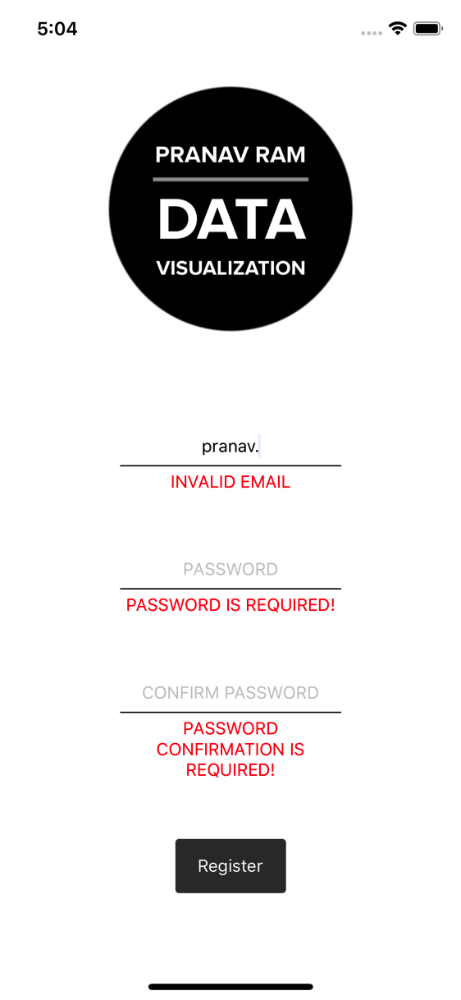

This post will get you up to speed using Formik and Yup to make form management easy. I'm using React Native in this post but all this should apply to React as well.

<div style="margin-bottom: 16px;">
<div data-snack-id="@pranavram/formik---yup" data-snack-platform="ios" data-snack-preview="true" data-snack-theme="light" style="overflow:hidden;background:#fafafa;border:1px solid rgba(0,0,0,.08);border-radius:4px;height:505px;width:100%"></div>
</div>

### Goals

- Create a registration form in React Native using Formik and Yup
  - The form will include a user's email, password and a password confirmation with the necessary validations
  - Errors to guide the user to a successful form submission


#### Prerequisites

##### Optional: Install *expo-cli*

```
npm i -g expo-cli
```


#### Create a new project and install the dependencies

```
expo init
```

```
npm i -S formik yup react-native-flash-message

OR

yarn add formik yup react-native-flash-message
```


#### Project Structure

The following project map should give you a good understanding of where the files are located in case you get stuck.


#### Walkthrough

##### Add the Button and Input components

The Button component will be used for our form submission while the Input component will be used by the email, password and password confirmation inputs.

**src/components/Button/index.js**

```jsx{numberLines: true}
import React from 'react';
import { TouchableOpacity, Text, StyleSheet } from 'react-native';
import PropTypes from 'prop-types';

const Button = props => {
  return (
    <TouchableOpacity style={styles.button} onPress={props.onClick}>
      <Text style={styles.buttonText}>{props.text}</Text>
    </TouchableOpacity>
  );
};

Button.propTypes = {
  onClick: PropTypes.func,
  text: PropTypes.string
};

const styles = StyleSheet.create({
  button: {
    height: 44,
    width: 90,
    backgroundColor: '#353535',
    borderRadius: 3,
    justifyContent: 'center',
    alignItems: 'center',
    marginBottom: 0
  },
  buttonText: {
    color: 'white'
  }
});

export default Button;

```

**src/components/Input/index.js**

```jsx{numberLines: true}
import React from 'react';
import { View, TextInput, StyleSheet } from 'react-native';
import PropTypes from 'prop-types';

const Input = props => {
  return (
    <View style={styles.inputContainer}>
      <TextInput
        { /* highlight-next-line */ }
        secureTextEntry={props.password}
        underlineColorAndroid="rgba(0,0,0,0)"
        style={styles.input}
        autoCapitalize="none"
        placeholder={props.placeholder}
        onChangeText={props.onChangeText}
        value={props.value}
      />
    </View>
  );
};

Input.propTypes = {
  placeholder: PropTypes.string.isRequired,
  onChangeText: PropTypes.func,
  value: PropTypes.string
  password: PropTypes.bool
};

const styles = StyleSheet.create({
  inputContainer: {
    width: '100%',
    borderBottomWidth: 1
  },
  input: {
    textAlign: 'center',
    height: 30
  }
});

export default Input;
```

Everything should look pretty straightforward. The only point of interest is on line **9** to differentiate between a regular input and the password input. Here we expect a prop **password** to be present when we want the **secureTextEntry** flag to be active


##### Setup the User Registration Screen

**src/screens/UserRegistrationScreen/index.js**

```jsx{numberLines: true}
import React from 'react';
import { SafeAreaView, View, StyleSheet, Image, Text } from 'react-native';
import Button from '../../components/Button';
import Input from '../../components/Input';

const logo = require('../../../assets/logo/logo.png');

export default class UserRegistration extends React.Component {
  render() {
    return (
      <SafeAreaView style={styles.container}>
        <Image source={logo} resizeMode="contain" style={styles.logo} />
        <View style={styles.formWrapper}>
          <View style={styles.inputWrapper}>
            <Input
              placeholder="EMAIL"
            />
          </View>
          <View style={styles.inputWrapper}>
            <Input
              placeholder="PASSWORD"
              password
            />
          </View>
          <View style={styles.inputWrapper}>
            <Input
              placeholder="CONFIRM PASSWORD"
              password
            />
          </View>
          <Button text="Register" />
        </View>
      </SafeAreaView>
    );
  }
}

const styles = StyleSheet.create({
  container: {
    flex: 1,
    justifyContent: 'space-between',
    alignItems: 'center',
    backgroundColor: 'white',
    width: '100%'
  },
  logo: {
    width: 200
  },
  formWrapper: {
    flex: 1,
    justifyContent: 'center',
    alignItems: 'center',
    width: '100%'
  },
  inputWrapper: {
    marginBottom: 48,
    width: 180
  }
});
```

We then need to edit the **App.js** file to render our Registration screen

**App.js**

```jsx{numberLines: true}
import React from 'react';
import { StyleSheet, Text, View } from 'react-native';
import UserRegistration from './src/screens/UserRegistrationScreen';

export default class App extends React.Component {
  render() {
    return (
      <View style={styles.container}>
        <UserRegistration />
      </View>
    );
  }
}

const styles = StyleSheet.create({
  container: {
    flex: 1,
    backgroundColor: '#fff',
    alignItems: 'center',
    justifyContent: 'center'
  }
});

```

After all this, you'll be greeted with the follow non-functioning, albeit pretty, registration page.


Moving on, we'll now introduce **Formik** and **Yup** to help us with the form management

**src/screens/UserRegistrationScreen/index.js**

```jsx{numberLines: true}
import React from 'react';
import { SafeAreaView, View, StyleSheet, Image, Text } from 'react-native';
import { Formik } from 'formik';

import Button from '../../components/Button';
import Input from '../../components/Input';

const logo = require('../../../assets/logo/logo.png');

export default class UserRegistration extends React.Component {
  render() {
    return (
      <SafeAreaView style={styles.container}>
        <Image source={logo} resizeMode="contain" style={styles.logo} />
        {/* highlight-range{1-6} */}
        <Formik
          initialValues={{
            email: '',
            password: '',
            passwordConfirm: ''
          }}
          onSubmit={(values, { resetForm }) => {
            console.log(values);
            resetForm({});
          }}
        >
          {({ handleSubmit, handleChange, values }) => (
            <View style={styles.formWrapper}>
              { /* highlight-range{2-3} */ }
              <View style={styles.inputWrapper}>
                <Input
                  placeholder="EMAIL"
                  onChangeText={handleChange('email')}
                  value={values.email}
                />
              </View>
              { /* highlight-range{2-3} */ }
              <View style={styles.inputWrapper}>
                <Input
                  placeholder="PASSWORD"
                  password
                  onChangeText={handleChange('password')}
                  value={values.password}
                />
              </View>
              { /* highlight-range{2-3} */ }
              <View style={styles.inputWrapper}>
                <Input
                  placeholder="CONFIRM PASSWORD"
                  password
                  onChangeText={handleChange('passwordConfirm')}
                  value={values.passwordConfirm}
                />
              </View>
              <Button onClick={handleSubmit} text="Register" />
            </View>
          )}
        </Formik>
      </SafeAreaView>
    );
  }
}

const styles = StyleSheet.create({
  container: {
    flex: 1,
    justifyContent: 'space-between',
    alignItems: 'center',
    backgroundColor: 'white',
    width: '100%'
  },
  logo: {
    width: 200
  },
  formWrapper: {
    flex: 1,
    justifyContent: 'center',
    alignItems: 'center',
    width: '100%'
  },
  inputWrapper: {
    marginBottom: 48,
    width: 180
  }
});

```

In this instance we use **Formik** as a HOC (Higher Order Component) that takes a few props, such as the initial values, submission handler, validation (which we'll get to in a bit), etc and injects some useful parameters that help with managing our form. 

Our intial values are email, password and passwordConfirm.

**handleChange** let's us capture changes in the input fields for each entry. **handleChange('email')** stores changes in the email field; **handleChange('password')** and **handleChange('passwordConfirm')** do the same for the password and passwordConfiirm fields.

The fields in the **values** argument are passed to their respective inputs to ensure the stateless components reflect the correct value. This is useful when we need to reset the form. Without explicity resetting the inputs, they'll continue to store the user entered values.

With all this work, we haven't done much from a functionality standpoint. The only difference now is that the form values will be reset on tapping the **Register** button.

Let's change that

```jsx{numberLines: true}
import React from 'react';
import { SafeAreaView, View, StyleSheet, Image, Text } from 'react-native';
import { Formik } from 'formik';

import Button from '../../components/Button';
import Input from '../../components/Input';
import validate from '../../utils/FormValidations/registrationValidation';

const logo = require('../../../assets/logo/logo.png');

export default class UserRegistration extends React.Component {
  render() {
    return (
      <SafeAreaView style={styles.container}>
        <Image source={logo} resizeMode="contain" style={styles.logo} />
        { /* highlight-range{1-4} */ }
        <Formik
          initialValues={{
            email: '',
            password: '',
            passwordConfirm: ''
          }}
          onSubmit={(values, { resetForm }) => {
            console.log(values);
            resetForm({});
          }}
          validate={validate}
        >
          {({ handleSubmit, handleChange, errors, values, touched }) => (
            <View style={styles.formWrapper}>
              <View style={styles.inputWrapper}>
                <Input
                  placeholder="EMAIL"
                  onChangeText={handleChange('email')}
                  value={values.email}
                /> { /* highlight-range{1-4} */ }
                {errors.email && touched.email && (
                  <Text style={styles.errorInput}>
                    {errors.email.toUpperCase()}
                  </Text>
                )}
              </View>
              <View style={styles.inputWrapper}>
                <Input
                  placeholder="PASSWORD"
                  password
                  onChangeText={handleChange('password')}
                  value={values.password}
                /> { /* highlight-range{1-4} */ }
                {errors.password && touched.password && (
                  <Text style={styles.errorInput}>
                    {errors.password.toUpperCase()}
                  </Text>
                )}
              </View>
              <View style={styles.inputWrapper}>
                <Input
                  placeholder="CONFIRM PASSWORD"
                  password
                  onChangeText={handleChange('passwordConfirm')}
                  value={values.passwordConfirm}
                /> { /* highlight-range{1-4} */ }
                {errors.passwordConfirm && touched.passwordConfirm && (
                  <Text style={styles.errorInput}>
                    {errors.passwordConfirm.toUpperCase()}
                  </Text>
                )}
              </View>
              <Button onClick={handleSubmit} text="Register" />
            </View>
          )}
        </Formik>
      </SafeAreaView>
    );
  }
}

const styles = StyleSheet.create({
  container: {
    flex: 1,
    justifyContent: 'space-between',
    alignItems: 'center',
    backgroundColor: 'white',
    width: '100%'
  },
  logo: {
    width: 200
  },
  formWrapper: {
    flex: 1,
    justifyContent: 'center',
    alignItems: 'center',
    width: '100%'
  },
  inputWrapper: {
    marginBottom: 48,
    width: 180
  }, // highlight-start
  errorInput: { 
    color: 'red',
    textAlign: 'center',
    marginTop: 4
  } // highlight-end
});
```

The most important addition we've made is on line **27**. We've added a **validate** prop to the Formik element. This function is called with our form values to help Formik verify that the form is good to go. Let's take a look at it.

**src/utils/FormValidations/registrationValidation.js**

```javascript{numberLines: true}
import * as Yup from 'yup';

function getValidationSchema(values) {
  return Yup.object().shape({
    password: Yup.string().required('Password is required!'),
    passwordConfirm: Yup.string()
      .oneOf([values.password], 'Passwords are not the same!')
      .required('Password confirmation is required!'),
    email: Yup.string()
      .email('Invalid email')
      .required('Required')
  });
}

function getErrorsFromValidationError(validationError) {
  const FIRST_ERROR = 0;
  return validationError.inner.reduce((errors, error) => {
    return {
      ...errors,
      [error.path]: error.errors[FIRST_ERROR]
    };
  }, {});
}

export default function validate(values) {
  const validationSchema = getValidationSchema(values);
  try {
    validationSchema.validateSync(values, { abortEarly: false });
    return {};
  } catch (error) {
    return getErrorsFromValidationError(error);
  }
}

```

Our **validate** function validates the values with the schema **getValidationSchema** and if we encounter an error, the **getErrorsFromValidationError** populates our errors object in Formik

Focusing on this:

```javascript{numberLines: true}
function getValidationSchema(values) {
  return Yup.object().shape({
    password: Yup.string().required('Password is required!'),
    passwordConfirm: Yup.string()
      .oneOf([values.password], 'Passwords are not the same!')
      .required('Password confirmation is required!'),
    email: Yup.string()
      .email('Invalid email')
      .required('Required')
  });
}
```

We observe the the email validation is straightforward. Even the password field is clear but it's the passwordConfirm field that requires some attention. Here we want to ensure that the password and passwordConfirm fields are the same so that a user doesn't goof up by entering an incorrect password and require a reset.

To do that, we simply set that passwordConfirm is required and is the same as the password field through the **oneOf** validator. We pass a single array element that is just the other password value.

That's all there is to it. We've already hooked up this function to Formik's validate prop so we're good to go. We've also added the necessary error messages below each of the inputs so that we know what went wrong.


All fields are incorrect




Passwords aren't the same


We'll wrap this up by adding a flash message to let the user know the form was successfully submitted

**src/screens/UserRegistrationScreen/index.js**

```jsx{numberLines: true}
import React from 'react';
import { SafeAreaView, View, StyleSheet, Image, Text } from 'react-native';
import { Formik } from 'formik';
import FlashMessage, { showMessage } from 'react-native-flash-message';

import Button from '../../components/Button';
import Input from '../../components/Input';
import validate from '../../utils/FormValidations/registrationValidation';

const logo = require('../../../assets/logo/logo.png');

export default class UserRegistration extends React.Component {
  render() {
    return (
      <SafeAreaView style={styles.container}>
        <Image source={logo} resizeMode="contain" style={styles.logo} />
        <Formik
          initialValues={{
            email: '',
            password: '',
            passwordConfirm: ''
          }}
          onSubmit={(values, { resetForm }) => {
            console.log(values);
            // highlight-range{1-4}
            showMessage({
              message: 'Success!',
              type: 'success'
            });
            resetForm({});
          }}
          validate={validate}
        >
          {({ handleSubmit, handleChange, errors, values, touched }) => (
            <View style={styles.formWrapper}>
              <View style={styles.inputWrapper}>
                <Input
                  placeholder="EMAIL"
                  onChangeText={handleChange('email')}
                  value={values.email}
                />
                {errors.email && touched.email && (
                  <Text style={styles.errorInput}>
                    {errors.email.toUpperCase()}
                  </Text>
                )}
              </View>
              <View style={styles.inputWrapper}>
                <Input
                  placeholder="PASSWORD"
                  password
                  onChangeText={handleChange('password')}
                  value={values.password}
                />
                {errors.password && touched.password && (
                  <Text style={styles.errorInput}>
                    {errors.password.toUpperCase()}
                  </Text>
                )}
              </View>
              <View style={styles.inputWrapper}>
                <Input
                  placeholder="CONFIRM PASSWORD"
                  password
                  onChangeText={handleChange('passwordConfirm')}
                  value={values.passwordConfirm}
                />
                {errors.passwordConfirm && touched.passwordConfirm && (
                  <Text style={styles.errorInput}>
                    {errors.passwordConfirm.toUpperCase()}
                  </Text>
                )}
              </View>
              <Button onClick={handleSubmit} text="Register" />
            </View>
          )}
        </Formik>
        {/* highlight-next-line */}
        <FlashMessage position="top" />
      </SafeAreaView>
    );
  }
}

const styles = StyleSheet.create({
  container: {
    flex: 1,
    justifyContent: 'space-between',
    alignItems: 'center',
    backgroundColor: 'white',
    width: '100%'
  },
  logo: {
    width: 200
  },
  formWrapper: {
    flex: 1,
    justifyContent: 'center',
    alignItems: 'center',
    width: '100%'
  },
  inputWrapper: {
    marginBottom: 48,
    width: 180
  },
  errorInput: {
    color: 'red',
    textAlign: 'center',
    marginTop: 4
  }
});
```


We'll make this form view more robust in the next post with a keyboard aware view and make it play nicely with smaller screens.
