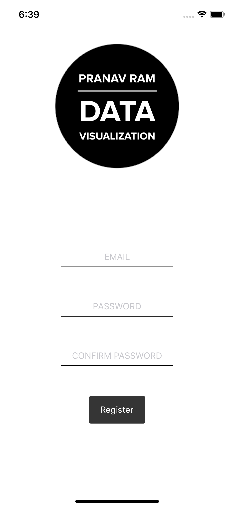
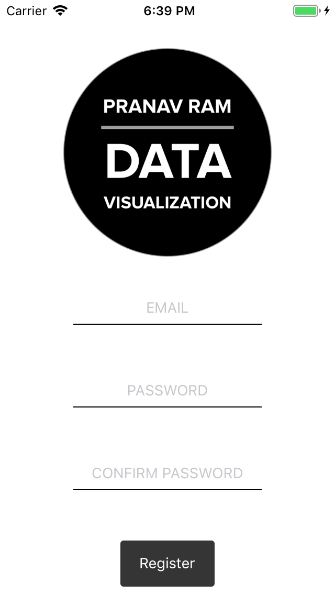
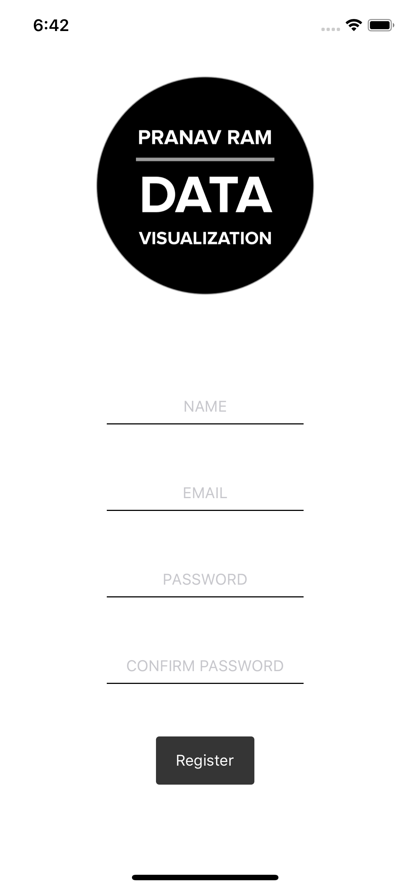
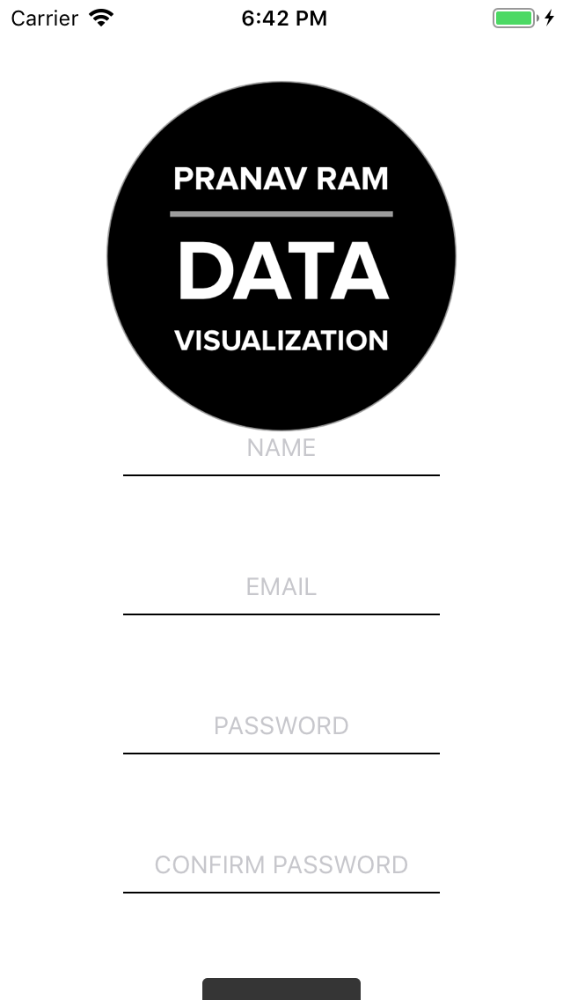

This post is a follow up to **[Forms in React Native with Formik and Yup](https://www.pranavram.com/blog/react-native-formik-yup/)** where we'll make a responsive scrollview.

<div style="margin-bottom: 16px;">
<div data-snack-id="@pranavram/react-native-responsive-scrollview" data-snack-platform="ios" data-snack-preview="true" data-snack-theme="light" style="overflow:hidden;background:#fafafa;border:1px solid rgba(0,0,0,.08);border-radius:4px;height:605px;width:100%"></div>
</div>

### Goals

- Create a responsive scrollview in React Native to handle content larger than the screen
  - Use **onContentSizeChange**, **scrollEnabled** and **onScroll** properties of the **ScrollView** to adjust the screen size
  - Add an indicator to let the user know that there is more content to scroll down to


#### Why do we want to do this?

Let's take a look at the problem we're trying to solve:

When our form content takes up less space than the height of the screen (minus the statusbar), everything looks fine:

<div class="row">
  <div class="column-50">
    <p class="caption">iPhone X</p>
    
  </div>
  <div class="column-50">
    <p class="caption">iPhone 5s</p>
    
  </div>
</div>


Now let's add another field to the form, **Name**. This is the result

<div class="row">
  <div class="column-50">
    <p class="caption">iPhone X</p>
    
  </div>
  <div class="column-50">
    <p class="caption">iPhone 5s</p>
    
  </div>
</div>

See the problem with the iPhone 5S display? The button is cut off. In this case, we want to let the user scroll the view while for the iPhone X, things will continue to be the same.

#### Prerequisites

Make sure you've completed the steps in **[Forms in React Native with Formik and Yup](https://www.pranavram.com/blog/react-native-formik-yup/)**. We'll be picking up things from there

#### Walkthrough

This is what our **UserRegistrationScreen** looks like

**src/screens/UserRegistrationScreen/index.js**

```jsx{numberLines: true}
import React from 'react';
import { SafeAreaView, View, StyleSheet, Image, Text } from 'react-native';
import { Formik } from 'formik';
import FlashMessage, { showMessage } from 'react-native-flash-message';
import { KeyboardAwareScrollView } from 'react-native-keyboard-aware-scroll-view';

import Button from '../../components/Button';
import Input from '../../components/Input';
import validate from '../../utils/FormValidations/registrationValidation';

const logo = require('../../../assets/logo/logo.png');

export default class UserRegistration extends React.Component {
  render() {
    return (
      <SafeAreaView style={styles.container}>
        <KeyboardAwareScrollView contentContainerStyle={styles.container}>
          <Image source={logo} resizeMode="contain" style={styles.logo} />
          <Formik
            initialValues={{
              email: '',
              password: '',
              passwordConfirm: ''
            }}
            onSubmit={(values, { resetForm }) => {
              console.log(values);
              showMessage({
                message: 'Success!',
                type: 'success'
              });
              resetForm({});
            }}
            validate={validate}
          >
            {({ handleSubmit, handleChange, errors, values, touched }) => (
              <View style={styles.formWrapper}>
                <View style={styles.inputWrapper}>
                  <Input
                    placeholder="EMAIL"
                    onChangeText={handleChange('email')}
                    value={values.email}
                  />
                  {errors.email && touched.email && (
                    <Text style={styles.errorInput}>
                      {errors.email.toUpperCase()}
                    </Text>
                  )}
                </View>
                <View style={styles.inputWrapper}>
                  <Input
                    placeholder="PASSWORD"
                    password
                    onChangeText={handleChange('password')}
                    value={values.password}
                  />
                  {errors.password && touched.password && (
                    <Text style={styles.errorInput}>
                      {errors.password.toUpperCase()}
                    </Text>
                  )}
                </View>
                <View style={styles.inputWrapper}>
                  <Input
                    placeholder="CONFIRM PASSWORD"
                    password
                    onChangeText={handleChange('passwordConfirm')}
                    value={values.passwordConfirm}
                  />
                  {errors.passwordConfirm && touched.passwordConfirm && (
                    <Text style={styles.errorInput}>
                      {errors.passwordConfirm.toUpperCase()}
                    </Text>
                  )}
                </View>
                <Button onClick={handleSubmit} text="Register" />
              </View>
            )}
          </Formik>
          <FlashMessage position="top" />
        </KeyboardAwareScrollView>
      </SafeAreaView>
    );
  }
}

const styles = StyleSheet.create({
  container: {
    flex: 1,
    justifyContent: 'space-between',
    alignItems: 'center',
    backgroundColor: 'white',
    width: '100%'
  },
  logo: {
    width: 200
  },
  formWrapper: {
    flex: 1,
    justifyContent: 'center',
    alignItems: 'center',
    width: '100%'
  },
  inputWrapper: {
    marginBottom: 48,
    width: 180
  },
  errorInput: {
    color: 'red',
    textAlign: 'center',
    marginTop: 4
  }
});
```

With just a few changes, we can get the scroll working

**src/screens/UserRegistrationScreen/index.js****

```jsx{numberLines: true}
import React from 'react';
import { SafeAreaView, View, StyleSheet, Image, Text } from 'react-native';
import { Formik } from 'formik';
import FlashMessage, { showMessage } from 'react-native-flash-message';
import { KeyboardAwareScrollView } from 'react-native-keyboard-aware-scroll-view';

import Button from '../../components/Button';
import Input from '../../components/Input';
import validate from '../../utils/FormValidations/registrationValidation';

const logo = require('../../../assets/logo/logo.png');

export default class UserRegistration extends React.Component {  
  render() {
    {/* highlight-range{3-9} */}
    return (
      <SafeAreaView style={styles.container}>
        <KeyboardAwareScrollView
          style={styles.scrollViewContainer}
          contentContainerStyle={{
            flexGrow: 1,
            alignItems: 'center'
          }}
         >
          <Image source={logo} resizeMode="contain" style={styles.logo} />
          <Formik
            initialValues={{
              name: '',
              email: '',
              password: '',
              passwordConfirm: ''
            }}
            onSubmit={(values, { resetForm }) => {
              console.log(values);
              showMessage({
                message: 'Success!',
                type: 'success'
              });
              resetForm({});
            }}
            validate={validate}
          >
            {({ handleSubmit, handleChange, errors, values, touched }) => (
              <View style={styles.formWrapper}>
                <View style={styles.inputWrapper}>
                  <Input
                    placeholder="NAME"
                    onChangeText={handleChange('name')}
                    value={values.email}
                  />
                  {errors.name && touched.name && (
                    <Text style={styles.errorInput}>
                      {errors.name.toUpperCase()}
                    </Text>
                  )}
                </View>
                <View style={styles.inputWrapper}>
                  <Input
                    placeholder="EMAIL"
                    onChangeText={handleChange('email')}
                    value={values.email}
                  />
                  {errors.email && touched.email && (
                    <Text style={styles.errorInput}>
                      {errors.email.toUpperCase()}
                    </Text>
                  )}
                </View>
                <View style={styles.inputWrapper}>
                  <Input
                    placeholder="PASSWORD"
                    password
                    onChangeText={handleChange('password')}
                    value={values.password}
                  />
                  {errors.password && touched.password && (
                    <Text style={styles.errorInput}>
                      {errors.password.toUpperCase()}
                    </Text>
                  )}
                </View>
                <View style={styles.inputWrapper}>
                  <Input
                    placeholder="CONFIRM PASSWORD"
                    password
                    onChangeText={handleChange('passwordConfirm')}
                    value={values.passwordConfirm}
                  />
                  {errors.passwordConfirm && touched.passwordConfirm && (
                    <Text style={styles.errorInput}>
                      {errors.passwordConfirm.toUpperCase()}
                    </Text>
                  )}
                </View>
                <Button onClick={handleSubmit} text="Register" />
              </View>
            )}
          </Formik>
          <FlashMessage position="top" />
        </KeyboardAwareScrollView>
      </SafeAreaView>
    );
  }
}

const styles = StyleSheet.create({
  container: {
    flex: 1,
    justifyContent: 'space-between',
    alignItems: 'center',
    backgroundColor: 'white',
    width: '100%'
  },
  {/* highlight-next-line */}
  scrollViewContainer: { flex: 1, width: '100%' },
  logo: {
    width: 200
  },
  formWrapper: {
    flex: 1,
    justifyContent: 'center',
    alignItems: 'center',
    width: '100%'
  },
  inputWrapper: {
    marginBottom: 48,
    width: 180
  },
  errorInput: {
    color: 'red',
    textAlign: 'center',
    marginTop: 4
  }
});
```

Great, the scroll works for the iPhone 5S but it also is enabled for the iPhone X even though we're well within the screen height.

<div class="row">
  <div class="column-50">
    <p class="caption">iPhone X</p>
    
  </div>
  <div class="column-50">
    <p class="caption">iPhone 5s</p>
    
  </div>
</div>

We want a way to get the current height of the scrollview to make a decision, as to whether we want to allow the user to scroll the screen. ScrollView has a property called **onContentSizeChange** that gives us just that. We'll calculate the height of the current display, and if it is greater than the scrollview context plus the size of the statusbar, we'll toggle the flag **scrollEnabled**.

`scrollEnabled = contentHeight + statusBarHeight > SCREEN_HEIGHT`

I'd also like to add some padding for when we scroll, to ensure that the **Register** button has some breathing room.

**src/screens/UserRegistrationScreen/index.js****

```jsx{numberLines: true}
import React from 'react';
import {
  SafeAreaView,
  View,
  StyleSheet,
  Image,
  Text,
  {/* highlight-next-line */}
  Dimensions
} from 'react-native';
import { Formik } from 'formik';
import FlashMessage, { showMessage } from 'react-native-flash-message';
import { KeyboardAwareScrollView } from 'react-native-keyboard-aware-scroll-view';
import { Constants } from 'expo';   {/* highlight-line */}

import Button from '../../components/Button';
import Input from '../../components/Input';
import validate from '../../utils/FormValidations/registrationValidation';

const logo = require('../../../assets/logo/logo.png');

{/* highlight-range{1-2} */}
const SCREEN_HEIGHT = Dimensions.get('window').height;
const PADDING_BOTTOM = 24;

export default class UserRegistration extends React.Component {
  {/* highlight-range{1-3} */}
  state = {
    scrollEnabled: false,
  };
  
  {/* highlight-range{1-7} */}
  _onContentSizeChange = (_, contentHeight) => {
    const statusBarHeight = Constants.statusBarHeight;
    const scrollEnabled = contentHeight + statusBarHeight > SCREEN_HEIGHT;
    this.setState({
      scrollEnabled
    });
  };
  
  render() {
    {/* highlight-next-line */}
    let { scrollEnabled } = this.state;
     
    {/* highlight-range{7, 10-11} */}
    return (
      <SafeAreaView style={styles.container}>
        <KeyboardAwareScrollView
          style={styles.scrollViewContainer}
          contentContainerStyle={{
            flexGrow: 1,
            paddingBottom: scrollEnabled ? PADDING_BOTTOM : 0,
            alignItems: 'center'
          }}
          onContentSizeChange={this._onContentSizeChange}
          scrollEnabled={scrollEnabled}
         >
          <Image source={logo} resizeMode="contain" style={styles.logo} />
          <Formik
            initialValues={{
              name: '',
              email: '',
              password: '',
              passwordConfirm: ''
            }}
            onSubmit={(values, { resetForm }) => {
              console.log(values);
              showMessage({
                message: 'Success!',
                type: 'success'
              });
              resetForm({});
            }}
            validate={validate}
          >
            {({ handleSubmit, handleChange, errors, values, touched }) => (
              <View style={styles.formWrapper}>
                <View style={styles.inputWrapper}>
                  <Input
                    placeholder="NAME"
                    onChangeText={handleChange('name')}
                    value={values.email}
                  />
                  {errors.name && touched.name && (
                    <Text style={styles.errorInput}>
                      {errors.name.toUpperCase()}
                    </Text>
                  )}
                </View>
                <View style={styles.inputWrapper}>
                  <Input
                    placeholder="EMAIL"
                    onChangeText={handleChange('email')}
                    value={values.email}
                  />
                  {errors.email && touched.email && (
                    <Text style={styles.errorInput}>
                      {errors.email.toUpperCase()}
                    </Text>
                  )}
                </View>
                <View style={styles.inputWrapper}>
                  <Input
                    placeholder="PASSWORD"
                    password
                    onChangeText={handleChange('password')}
                    value={values.password}
                  />
                  {errors.password && touched.password && (
                    <Text style={styles.errorInput}>
                      {errors.password.toUpperCase()}
                    </Text>
                  )}
                </View>
                <View style={styles.inputWrapper}>
                  <Input
                    placeholder="CONFIRM PASSWORD"
                    password
                    onChangeText={handleChange('passwordConfirm')}
                    value={values.passwordConfirm}
                  />
                  {errors.passwordConfirm && touched.passwordConfirm && (
                    <Text style={styles.errorInput}>
                      {errors.passwordConfirm.toUpperCase()}
                    </Text>
                  )}
                </View>
                <Button onClick={handleSubmit} text="Register" />
              </View>
            )}
          </Formik>
          <FlashMessage position="top" />
        </KeyboardAwareScrollView>
      </SafeAreaView>
    );
  }
}

const styles = StyleSheet.create({
  container: {
    flex: 1,
    justifyContent: 'space-between',
    alignItems: 'center',
    backgroundColor: 'white',
    width: '100%'
  },
  scrollViewContainer: { flex: 1, width: '100%' },
  logo: {
    width: 200
  },
  formWrapper: {
    flex: 1,
    justifyContent: 'center',
    alignItems: 'center',
    width: '100%'
  },
  inputWrapper: {
    marginBottom: 48,
    width: 180
  },
  errorInput: {
    color: 'red',
    textAlign: 'center',
    marginTop: 4
  }
});
```

<div class="row">
  <div class="column-50">
    <p class="caption">iPhone X</p>
    
  </div>
  <div class="column-50">
    <p class="caption">iPhone 5s</p>
    
  </div>
</div>

Let's finally move on to giving the user an indication that there's more content below. I've chosen to use a down arrow icon that will disappear when the user has scrolled close to the end.

```jsx{numberLines: true}
import React from 'react';
import {
  SafeAreaView,
  View,
  StyleSheet,
  Image,
  Text,
  Dimensions
} from 'react-native';
import { Formik } from 'formik';
import FlashMessage, { showMessage } from 'react-native-flash-message';
import { KeyboardAwareScrollView } from 'react-native-keyboard-aware-scroll-view';
import { Constants } from 'expo';
import { Ionicons } from '@expo/vector-icons'; {/* highlight-line */}

import Button from '../../components/Button';
import Input from '../../components/Input';
import validate from '../../utils/FormValidations/registrationValidation';

const logo = require('../../../assets/logo/logo.png');

const SCREEN_HEIGHT = Dimensions.get('window').height;
const PADDING_BOTTOM = 24;

{/* highlight-range{1-6} */}
const isCloseToBottom = ({ layoutMeasurement, contentOffset, contentSize }) => {
  return (
    layoutMeasurement.height + contentOffset.y >=
    contentSize.height - PADDING_BOTTOM
  );
};

export default class UserRegistration extends React.Component {
  state = {
    scrollEnabled: false,
    showMoreIndicator: true {/* highlight-line */}
  };

  _onContentSizeChange = (_, contentHeight) => {
    const statusBarHeight = Constants.statusBarHeight;
    const scrollEnabled = contentHeight + statusBarHeight > SCREEN_HEIGHT;
    this.setState({
      scrollEnabled
    });
  };

  {/* highlight-range{1-7} */}
  _onScroll = ({ nativeEvent }) => {
    if (isCloseToBottom(nativeEvent)) {
      this._disableMoreIndicator();
      return;
    }
    this._enableMoreIndicator();
  };

  {/* highlight-range{1-5} */}
  _disableMoreIndicator = () => {
    this.setState({
      showMoreIndicator: false
    });
  };

  {/* highlight-range{1-5} */}
  _enableMoreIndicator = () => {
    this.setState({
      showMoreIndicator: true
    });
  };

  {/* highlight-range{1-5} */}
  _scrollToEnd = () => {
    if (this._scrollView) {
      this._scrollView.scrollToEnd();
    }
  };

  render() {
    {/* highlight-range{1-2} */}
    let { showMoreIndicator, scrollEnabled } = this.state;
    if (!scrollEnabled) showMoreIndicator = false;
    {/* highlight-range{12-15} */}
    return (
      <SafeAreaView style={styles.container}>
        <KeyboardAwareScrollView
          style={styles.scrollViewContainer}
          contentContainerStyle={{
            flexGrow: 1,
            paddingBottom: scrollEnabled ? PADDING_BOTTOM : 0,
            alignItems: 'center'
          }}
          onContentSizeChange={this._onContentSizeChange}
          scrollEnabled={scrollEnabled}
          innerRef={ref => {
            this._scrollView = ref;
          }}
          onScroll={this._onScroll}
        >
          <Image source={logo} resizeMode="contain" style={styles.logo} />
          <Formik
            initialValues={{
              name: '',
              email: '',
              password: '',
              passwordConfirm: ''
            }}
            onSubmit={(values, { resetForm }) => {
              console.log(values);
              showMessage({
                message: 'Success!',
                type: 'success'
              });
              resetForm({});
            }}
            validate={validate}
          >
            {({ handleSubmit, handleChange, errors, values, touched }) => (
              <View style={styles.formWrapper}>
                <View style={styles.inputWrapper}>
                  <Input
                    placeholder="NAME"
                    onChangeText={handleChange('name')}
                    value={values.email}
                  />
                  {errors.name && touched.name && (
                    <Text style={styles.errorInput}>
                      {errors.name.toUpperCase()}
                    </Text>
                  )}
                </View>
                <View style={styles.inputWrapper}>
                  <Input
                    placeholder="EMAIL"
                    onChangeText={handleChange('email')}
                    value={values.email}
                  />
                  {errors.email && touched.email && (
                    <Text style={styles.errorInput}>
                      {errors.email.toUpperCase()}
                    </Text>
                  )}
                </View>
                <View style={styles.inputWrapper}>
                  <Input
                    placeholder="PASSWORD"
                    password
                    onChangeText={handleChange('password')}
                    value={values.password}
                  />
                  {errors.password && touched.password && (
                    <Text style={styles.errorInput}>
                      {errors.password.toUpperCase()}
                    </Text>
                  )}
                </View>
                <View style={styles.inputWrapper}>
                  <Input
                    placeholder="CONFIRM PASSWORD"
                    password
                    onChangeText={handleChange('passwordConfirm')}
                    value={values.passwordConfirm}
                  />
                  {errors.passwordConfirm && touched.passwordConfirm && (
                    <Text style={styles.errorInput}>
                      {errors.passwordConfirm.toUpperCase()}
                    </Text>
                  )}
                </View>
                <Button onClick={handleSubmit} text="Register" />
              </View>
            )}
          </Formik>
          <FlashMessage position="top" />
        </KeyboardAwareScrollView>
        {/* highlight-range{1-10} */}
        {showMoreIndicator && (
          <View style={styles.moreIndicator}>
            <Ionicons
              name="ios-arrow-dropdown-circle"
              size={32}
              color="black"
              onPress={this._scrollToEnd}
            />
          </View>
        )}
      </SafeAreaView>
    );
  }
}

const styles = StyleSheet.create({
  container: {
    flex: 1,
    justifyContent: 'space-between',
    alignItems: 'center',
    backgroundColor: 'white',
    width: '100%'
  },
  scrollViewContainer: { flex: 1, width: '100%' },
  logo: {
    width: 200
  },
  formWrapper: {
    flex: 1,
    justifyContent: 'center',
    alignItems: 'center',
    width: '100%'
  },
  inputWrapper: {
    marginBottom: 48,
    width: 180
  },
  errorInput: {
    color: 'red',
    textAlign: 'center',
    marginTop: 4
  },
  {/* highlight-next-line */}
  moreIndicator: { position: 'absolute', right: 16, bottom: 16 }
});
```

<div style="display: flex; justify-content: center">
  
</div>
And that's a wrap for this 2 part series.


<div style="height: 32px;"></div>
